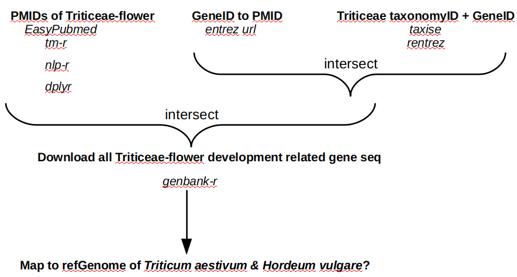

# README

Thesis title: 
# "Comparative transcriptomics of floral development in barley and wheat"
***
Tasks
# 1. Text mining for flower development related genes
***

Workflow
***
## 1.1 Create ref.gen-collection related to floral development in *Triticeae*:
#### 1.1.1 Experiment with methods to download and import pubmed abstract data in text-mining accessable format:
* EasyPubmed, RISmed, or direct download and parse xml into csv
* file **`Text_mining_methods`**: practice of batch-download of Pubmed article data with different R packages, located in `Failed_scripts` directory
    - packages: `RisMed`, `EasyPubmed`
#### 1.1.2 Download all *Triticeae* article information
* file **`Triticeae_abstracts_download`**: download of all *Triticeae* abstracts on 02.04.2020 and create a merged table of all the available articles with their PMIDs and abstracts
    - search-words: used from NCBI *Triticeae* Taxonomy ranking page, all manually typed + common names (bread wheat, barley) 
    - packages: `EasyPubmed`, `dplyr, parallel, foreach, doParallel`
* file **`final_triticeae.tsv/.rds`**: final merged table of all the downloaded **80 826 Pubmed records**
#### 1.1.3 Text mining
* format data into text-mineable format
* filter abstracts with keywords for flower development and sum up the lists of PMIDs
* same for transcriptomic papers as a subset from flower-related papers
* **used keywords for flower:** anther, fertility, floral, floret, inflorescence, palea, panicle, pistil, stamen
* **used keywords for transcriptomic papers:** comparative, epxress, rna, sequencing, transcriptomics
* file **`Triticeae_text_mining`**: creation and filtering of corpus for joint list of PMIDs related to flower-development and to transcriptomics papers
    - packages: `tm, nlp, dplyr, wordcloud, SnowballC, upsetR, ggplot2, grid`
* file: **`PMIDlist_flower.tsv/rds`**: PMID list of flower-development related articles
* file: **`PMIDlist_transcript.tsv/rds`**: PMID list of transcriptomic papers (subset) from the flower-development related list
#### 1.1.4 Intersect the 3 dataset to gain final list of GeneIDs
* intersect Gene2Pubmed and TaxID+GeneID tables - to get a table with TaxIDs+GeneIDs+PMIDs
* intersect flower-PMIDs with TaxID+GeneID+PMIDs table - to reach final list of GeneIDs
* file **`Triticeae_gene_download`**: the intersection of the 3 above mentioned datasets to gain a single list of GeneIDs. This list will be used to batch download all the `fasta` files to map them 
    - packages: `usethis, taxise, dplyr`
## 1.2 Based on GeneIDs get gene sequences and other information from NCBI Genebank
#### 1.2.1 Download genbank information
* file: **`Triticeae_gene_download`**:
    - packages: `genbank-r, rentrez`, `taxize`
#### 1.2.2 Map all sequences to reference genomes
* use STAR?

# 2. Reanalyse example dataset using knowledge from RNA-seq practical

#### 2.1.0 download all Transcriptomic-publications data (53 papers)
* file: **`Triticeae_transcriptomics_download`**: 53 articles cannot be linked to GeneIDs and have transcriptomic analyses, with their data online available, here I try to download them in a reproducable way
    - packages: `ArrayExpress`

#### 2.1.1 download data from the chosen study (for wheat)
* **study A:** "Identification of Wheat Inflorescence Development-Related Genes Using a Comparative Transcriptomics Approach"
    - **accession for data:** study B and study C and https://wheat-urgi.versailles.inra.fr/Seq-Repository/Expression
    - **PMID:** 29581960
    - **additional:** identified 170 wheat genes for floral identity determination, anther and pollen development, pollen-pistil interaction
    - 170 genes seqs are in Supplement
    - **article:** https://www.hindawi.com/journals/ijg/2018/6897032/
* **study B:** “Pistillody mutant reveals key insights into stamen and pistil development in wheat (Triticum aestivum L.),” BMC Genomics, 2015.
    - **accession number:** NCBI SRP038912
    - **PMID:** 
    - **additional information:** Illumina Hiseq 2000, from pistil-stamen-pistillody stamen tissues, total size of 40.88 Gbp after preprocessing
    - **article:** https://bmcgenomics.biomedcentral.com/articles/10.1186/s12864-015-1453-0
* **study C:** WheatExp: An Expression Database for Polyploid Wheat (https://wheat.pw.usda.gov/WheatExp/)
    - **accession:** https://www.ebi.ac.uk/ena/data/view/PRJEB5314
    - **additional inf.:** Developmental timecourse in five tissues: Five different wheat tissues (Spike, root, leaf, grain and stem) each sampled at three different developmental stages, 
    providing a broad overview of gene expression during development. Data generated from hexaploid bread wheat (var. Chinese Spring) by Choulet et al. 2014 Science 345:1249721
* files: saved into nfs folder, path:

#### 2.1.2 download data from the chosen study (for barley)
* **study:** BaRTv1.0: an improved barley reference transcript dataset to determine accurate changes in the barley transcriptome using RNA-seq
    - **PMID:** 31829136
    - **article:** RNA-seq data consists of 11 different RNA-seq experiments, containing 808 samples and 19.3 billion reads
    - all Illumina HiSeq, many kinds of tissues - 4 datasets have flower samples
    - https://www.ncbi.nlm.nih.gov/pubmed/?term=BaRTv1.0%3A+an+improved+barley+reference+transcript+dataset+to+determine+accurate+changes+in+the+barley+transcriptome+using+RNA-seq

#### 2.2 Preprocessing & mapping

#### 2.3 Data wrangling

#### 2.4 Normalization

#### 2.5 DEGs

#### 2.6 GSEA

#### 2.7 WGCNA

# 3. Reanalyse example dataset with different methods suggested by Daniel

# 4. Test selected flower-development related Gene-set on example datasets

# 5. Build pipeline? for larger scale of analysis

